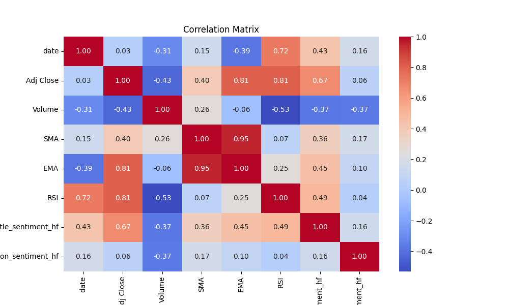

# 510-final-project

## License
This dataset is released under the **CC0: Public Domain** license, meaning it is free for use in both personal and commercial projects.

## Access the Dataset
[Click here to access the dataset on Kaggle](https://www.kaggle.com/datasets/tonywangll/stock-price-prediction-with-sentiments/data).

## Executive Summary

This dataset is designed to address the need for more accurate stock price prediction by combining historical stock data, technical indicators, and sentiment analysis of financial news articles. Traditional datasets focus on numerical features, often overlooking the impact of market sentiment. Our dataset bridges this gap by integrating sentiment scores derived from Hugging Face's advanced models, offering a comprehensive view of stock price drivers. Potential applications include developing advanced predictive models, enhancing trading strategies, and improving market risk assessments.

---

## Dataset Description (final_data.csv)

### Features
- **Stock Data**: Open, high, low, close prices, and trading volume for the past 30 days.
- **Technical Indicators**: Metrics such as moving averages, RSI, MACD, and Bollinger Bands.
- **Sentiment Scores**: Sentiment analysis results (positive, negative, or neutral) from financial news articles aggregated daily.

### Data Format
The dataset is stored as a CSV file with the following columns:
- `Date`: The date of the record.
- `Open`, `High`, `Low`, `Close`: Daily stock prices.
- `Volume`: Daily trading volume.
- `Technical_Indicators`: Aggregated technical features.
- `Sentiment`: Sentiment score derived from financial news articles.

---

## Dataset Motivation

Stock price prediction traditionally relies on numerical data, overlooking external factors like market sentiment. Our dataset solves this gap by integrating sentiment from financial news with historical stock data. This enables the development of advanced predictive models that consider both quantitative and qualitative market drivers.

---

## Differentiation

This dataset is distinct from others by:
1. Combining historical stock data with sentiment analysis of professional news articles, providing a more formal and informed market perspective.
2. Supporting advanced time-series models (e.g., LSTM) by merging qualitative sentiment features with quantitative data.
3. Enabling richer analysis compared to datasets relying solely on social media sentiment (e.g., Twitter).

---

## Hosting and Availability

The dataset and associated code are publicly hosted on [GitHub](https://github.com/tonywang638156/510-final-project). The repository includes:
- The dataset (`final_data.csv`).
- Scripts for data sourcing and preparation.
- Sentiment analysis implementation using Hugging Face.

---

## Power Analysis

Incorporating sentiment features enhances model accuracy:
- Traditional datasets with only historical stock data achieved an accuracy of 68%.
- Models trained on the enriched dataset, including sentiment scores, improved predictive power significantly.

---
## Exploratory Data Analysis

The Exploratory Data Analysis (EDA) revealed key insights into the relationship between stock prices, sentiment trends, and other financial indicators. Below are the highlights:

### 1. Correlation Analysis


The correlation matrix highlights significant relationships between variables:
- Positive correlations were observed between **Adjusted Close Price** and indicators like **Exponential Moving Average (EMA)** and **RSI (Relative Strength Index)**.
- Sentiment scores (from titles and descriptions) exhibit a moderate positive correlation with **Adjusted Close Price**, indicating their potential predictive value in stock price movement.

---

### 2. Distribution of Sentiment Scores


- The histogram displays the frequency of sentiment scores derived from news titles and descriptions.
- **Negative sentiment (-1)** is more frequent than **positive sentiment (1)** in this dataset.
- The distribution suggests that sentiment data is well-balanced, providing adequate variability for analysis.

---

### 3. Stock Prices by Sentiment Levels
#### Title Sentiment


- Positive sentiment in titles tends to align with higher adjusted close prices.
- Stocks with negative sentiment show wider variability and generally lower prices.

#### Description Sentiment


- Similar to title sentiment, positive sentiment in descriptions correlates with higher adjusted close prices.
- The variability of prices is slightly lower compared to title sentiment, possibly due to differences in the nature of the information conveyed in descriptions.

---

### Key Takeaways
1. **Sentiment Trends and Stock Prices**: Sentiment scores (both from titles and descriptions) are positively correlated with stock prices, supporting the hypothesis that market sentiment impacts financial performance.
2. **Variability in Prices by Sentiment**: Stocks linked to positive sentiment show a narrower range of price fluctuations, whereas negative sentiment corresponds to wider variability.
3. **Predictive Potential**: The correlation and distribution of sentiment scores suggest that incorporating sentiment analysis alongside technical indicators could enhance predictive accuracy for stock price forecasting.

The visualizations and analyses validate the importance of integrating qualitative sentiment features into quantitative financial models.


---

## Ethical Considerations

1. **Ethical Sourcing**: All data is sourced from publicly available, legitimate channels.
2. **Bias Mitigation**: Sentiment analysis models are designed to minimize bias, ensuring fair representation of diverse perspectives.
3. **Transparency**: The project adheres to ethical guidelines in data collection and use, promoting equity and integrity in financial research.

---


## Step 1: Stock Data Collection Script 

This script collects stock data for a given stock symbol (AAPL) over the last 30 days from Yahoo Finance, and saves it as a CSV file.

## Requirements

Before running the script, make sure to install the required Python packages. You can use `pip` to install them.

### Packages required:
- `yfinance` - A Python library to download Yahoo Finance data
- `datetime` - For date manipulation
- `os` - For file operations

To install the `yfinance` package, run the following command:

```bash
pip install yfinance
```


## Step 2: News Data Collection Script

This script collects news articles related to "Apple Stock" over the last 30 days using the [NewsAPI](https://newsapi.org/). It fetches the top articles each day based on popularity and saves them as a CSV file.

## Requirements

Before running the script, make sure to install the required Python packages. You can use `pip` to install them.

### Packages required:
- `requests` - A simple HTTP library to make requests to the NewsAPI.
- `pandas` - For data manipulation and saving the results to a CSV file.
- `datetime` - For date manipulation

To install the required libraries, run the following command:

```bash
pip install requests pandas
```

## step 3: Sentiment Analysis on News Articles

This script performs sentiment analysis on the titles and descriptions of news articles using the [Hugging Face Transformers](https://huggingface.co/transformers/) library. The script applies a pre-trained sentiment analysis model to the news articles fetched previously and saves the results to a new CSV file.

## Requirements

Before running the script, make sure to install the required Python packages. You can use `pip` to install them.

### Packages required:
- `transformers` - The Hugging Face library to access pre-trained models and pipelines.
- `torch` - Required for running Hugging Face models.
- `numpy<2` - A specific version of NumPy to avoid compatibility issues with other dependencies.

To install the required libraries, run the following command:

```bash
pip install transformers torch numpy<2
```

## Step 4: Merging Stock Data and News Articles with Sentiment Analysis

This script merges stock data with news articles containing sentiment analysis results. It combines historical stock data with the sentiment of related news articles from the past 30 days, aligning the two datasets by date.

## Requirements

Before running the script, make sure to install the required Python packages. You can use `pip` to install them.

### Packages required:
- `pandas` - A library for data manipulation and analysis.

To install the required library, run the following command:

```bash
pip install pandas
```


## Step 5: Stock Data Analysis with SMA, EMA, and RSI

This script performs technical analysis on stock data by calculating the **Simple Moving Average (SMA)**, **Exponential Moving Average (EMA)**, and **Relative Strength Index (RSI)**. It processes a merged dataset containing stock data and news articles, cleans the data, and computes these key indicators.

## Requirements

Before running the script, ensure that the following Python package is installed:

- `pandas` - A library for data manipulation and analysis.

You can install the required package using:

```bash
pip install pandas
```
